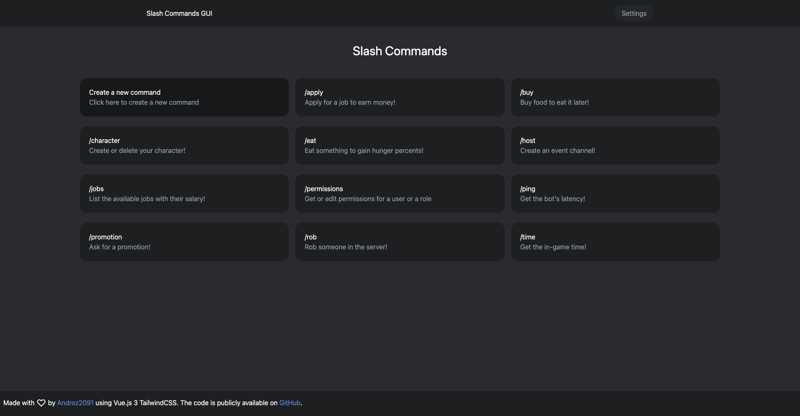
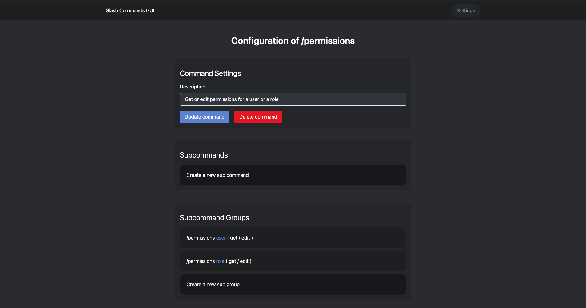
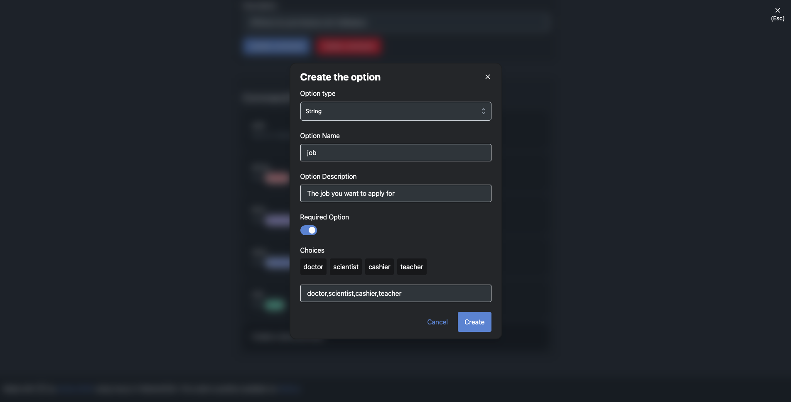

# [Slash Commands GUI](https://slash-commands-gui.netlify.app)

Graphical User Interface to explore Slash Commands of your bot, built on **[Vue 3](https://v3.vuejs.org/)** and **[TailwindCSS](https://tailwindcss.com/)** 🚀

## Features

**Everything you can do with HTTP requests you can also do with Slash Commands GUI.**  

Its goal is to provide a simple interface that allows you to better understand Slash Commands and modify them simply, without going through requests, sometimes complex. 

## Examples

### SlashCommandsGUI@next

* Add popups once commands are deleted or added.
* Add a way to configure both choice name and choice value (at this time the name is the same as the value).
* Add a way to update command permissions once **[#2315](https://github.com/discord/discord-api-docs/issues/2315#issuecomment-761131184)** is closed.
* Add a way to duplicate commands.
* Export commands to CURL (to create them on another guild for example).
* Generate a commands tree using canvas so we can easily see all the commands, their parameters, etc.

## Installation

* Clone the repository. (`git clone https://github.com/Androz2091/slash-commands-gui`)
* Install the dependencies. (`npm install` or `yarn install`)
* Start `vite` using `npm run dev` or `yarn dev`!

👋 Contributions to the project are appreciated so feel free to try to add cool stuff!

## CORS Proxy

Slash Commands GUI relies on a CORS proxy to make requests to the Discord API. This proxy is a simple [cors-anywhere proxy](https://github.com/Androz2091/androz2091-cors-anywhere). It is necessary because the Discord API does not send the CORS header.  
**Important note**: if you want to add an extra security level, you can host your own CORS proxy on your own machine. Press the **Settings** button during 3 seconds, and a new field will appear, allowing you to enter your proxy URL.

## Security

Authentication was one of the difficult things to do in this application. In v0.0.1, users had to enter their bot tokens. After talking with API contributors to get their opinion, it was removed in favor of authentication using the client ID and the client secret. This allows the application to generate and store an oAuth2 token with the scope `applications.commands.update` only, without having to store the bot token. Note that in any case, this application does not need a backend to work. All requests are made with the client (only through a CORS proxy, whose URL is configurable), so the risk of token hacking is almost null (someone would have to install a virus on your computer, and they would then only have access to an oauth token with the scope `applications.commands.update`).
